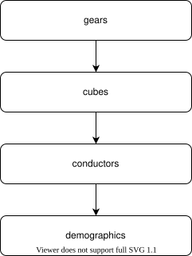

===========
Pilot Study
===========

    
    The order, in which had the participants solve tasks.

We ran a pilot study, to estimate the average time it takes a human or robot to complete a single operation.
For that, we asked participants to complete a simple task for each task-domain. 

To make evaluation easier, we performed task in a specific order:

Needed documents:

- Einverständniserklärung

- Teilnehmereinweisung